# Potentially Habitable Planets
---
### Team members:
|name|email|
|-|----------|
|Mariia Shmakova|m.shmakova@innopolis.university|
|Aruzhan Shinbayeva | a.shinbaeyeva@innopolis.university|
|Alsu Khairullina | a.khairullina@innopolis.university|

### Data Scraping
The data was scrapped from 3 sources using requests and pandas libraries:

1. [Earth Anagogs](https://en.wikipedia.org/wiki/Earth_analog) in wikipedia
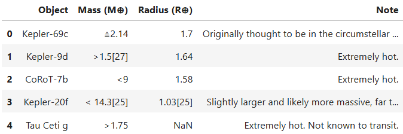

2. [List](https://en.wikipedia.org/wiki/List_of_potentially_habitable_exoplanets) of potentially habitable exoplanets in wikipedia

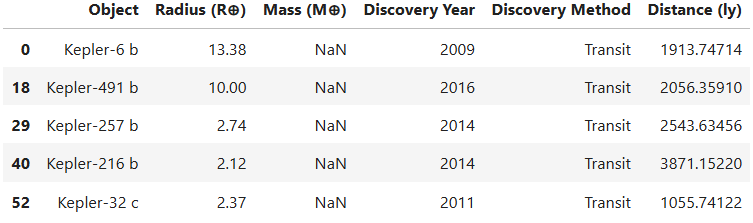

3. [Exoplanets data](https://exoplanetarchive.ipac.caltech.edu/) from NASA exoplanet archive

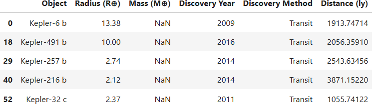

Then the data was combined into a single table using concatination in pandas.

Next, we collected data on each exoplanet from another [NASA website](https://science.nasa.gov/exoplanets/exoplanet-catalog/), where it was described in more detail about each of the planets and added the missing data to the table.

### Data Cleaning and Preprocessing
The data as it is contains a lot of inappropriate characters and spaces. 

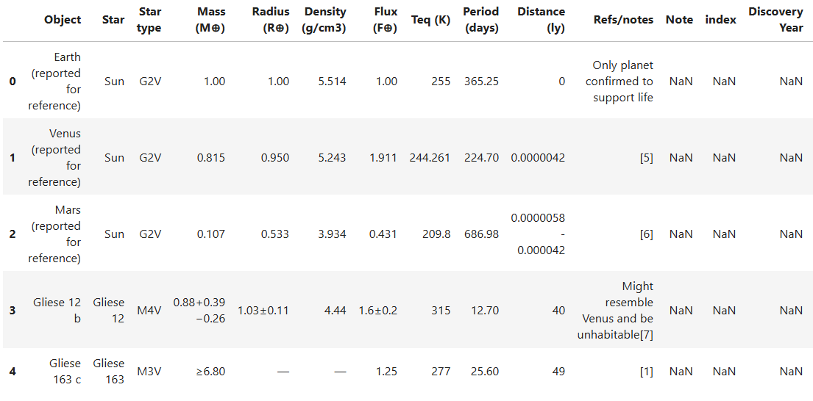

To improve our data, we will first remove the symbols (for example, ±, ≥, ~).

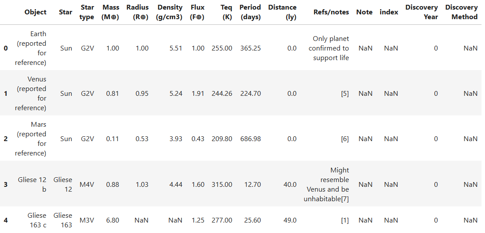

Then fill in the missing data using Gemini LLM.

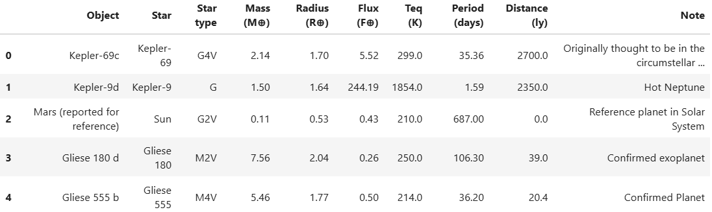

### Data Exploration and Processing
The most important class distributions:

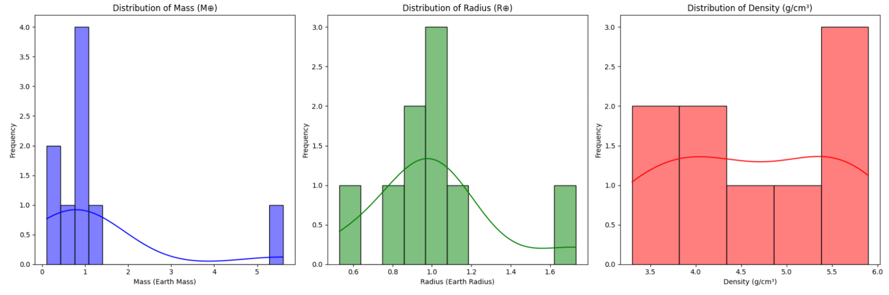

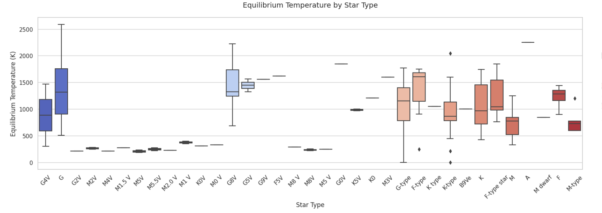

Features of the paired graph, here we can see that the Flow is directly proportional to the Temperature, the Period of rotation is directly proportional to the Temperature, the Mass of planet is proportional to the Radius of planet.

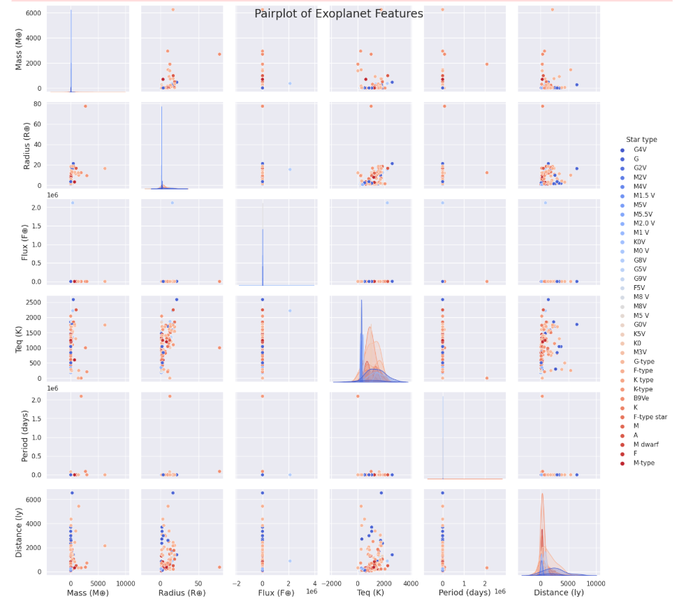

The correlation matrix confirms the conclusions drawn on the paired graphs.

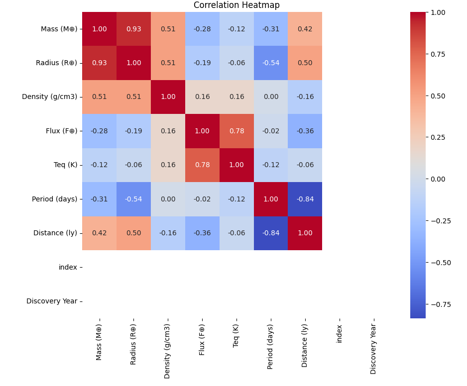

Then we start to plot some correlations between the classes:

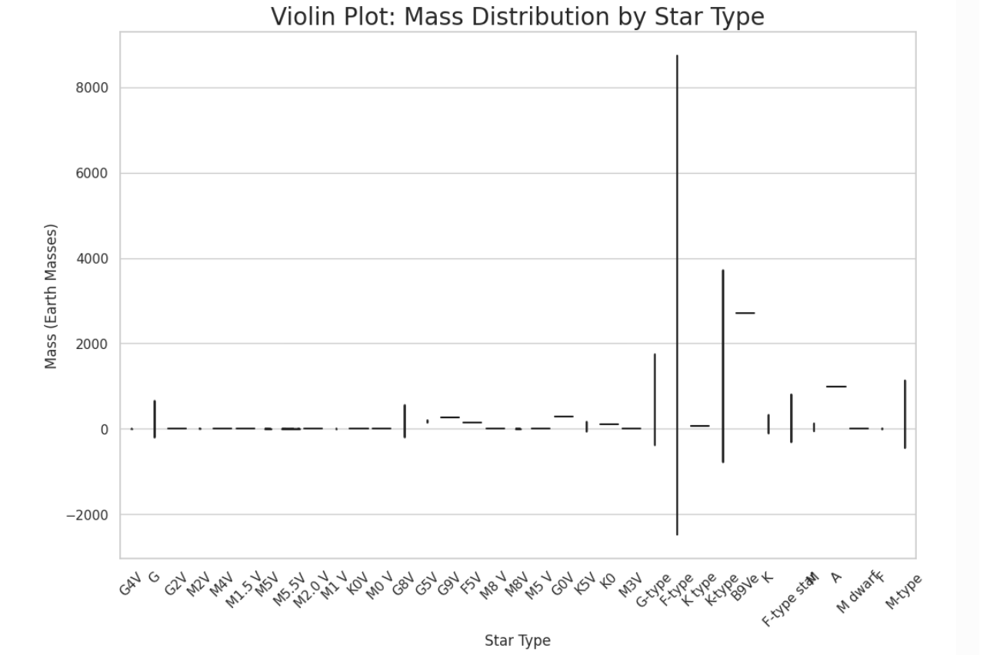

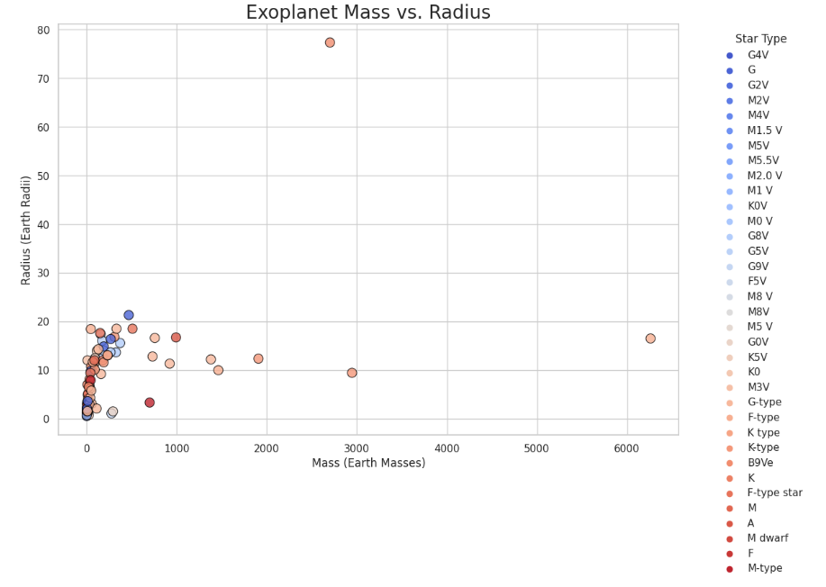

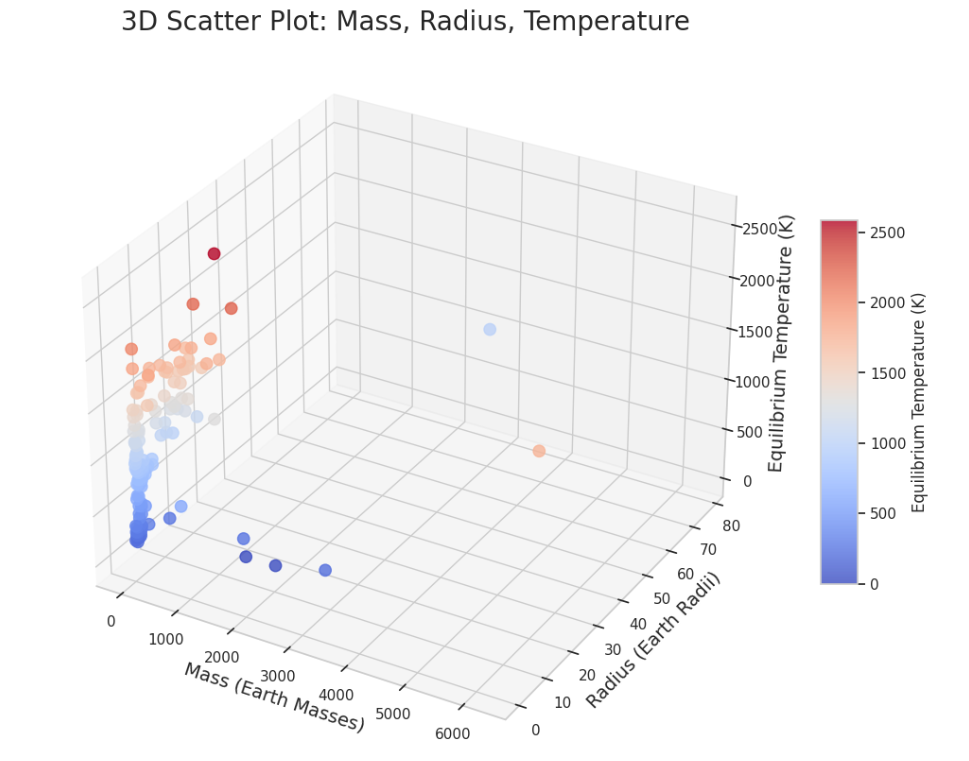

The relationship between the flow and temperature of the star is shown, with the additional allocation of the planet's radius as points on the graph.

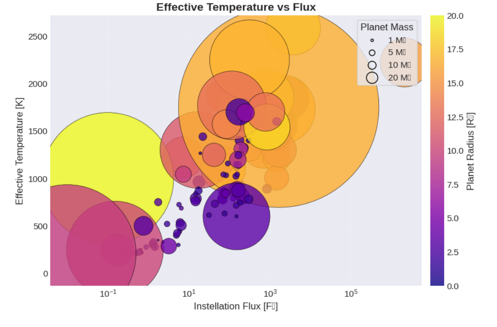

The relationship between the radius and flux of the star is shown, with the additional allocation of the planet's radius as points on the graph, as well as the division into zones: the purple zone of early Mars, the green habitable zone and the red runaway Greenhouse.

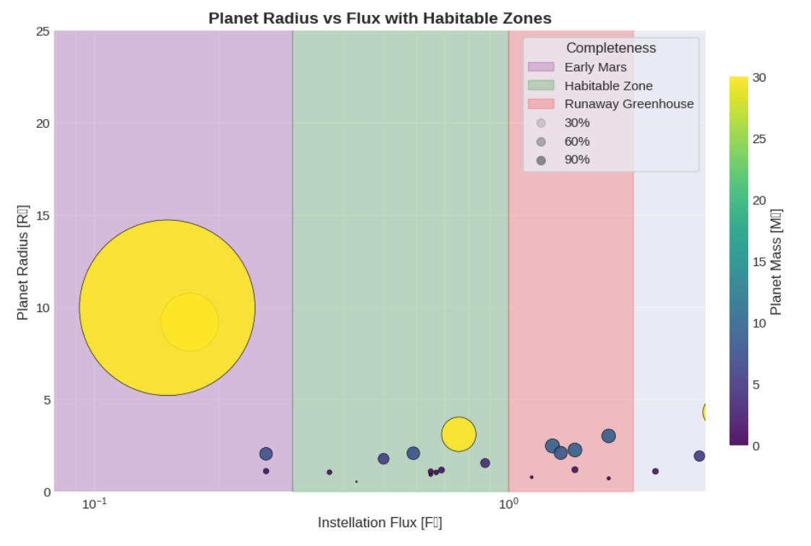

### Data Delivery

### Data Visualization
